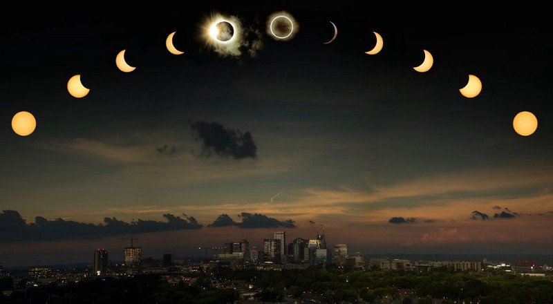
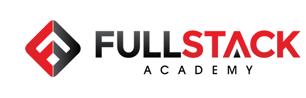

For the last few years I’ve tried to write one of these to remind myself of how many amazing things can happen in a year, mark accomplishments, maybe remember lessons learned, and to set my sights on the new year.

It looks like I missed writing one for 2017 probably because I was too busy prepping for [Fullstack Academy](/my-fullstack-academy-application-experience) at the end of the year so I’ll start with a very short recap.

## 2017 Rewind

Kerri and I bought our first home in the Spring of 2017 which was challenging mostly because of our inexperience with everything that goes into the process. I think anyone looking for a new home feels that stress though. Between all the showings, financing, negotiations, moving, and just generally getting into the homeowner mindset after all was said and done, it was exhausting!

We had a couple of hiccups along the way like needing to replace the AC just a few months after moving in. And a long list of minor fixes throughout the place that kept me busy; replacing window screens, power outlets, and light switches.

---

In August we drove down to Nashville to watch the solar eclipse which just so happened to fall exactly on my birthday. It was hot hot hot that weekend but watching the eclipse was one of the most incredible experiences of my life. I’ve seen videos of eclipses before and always felt like it was a pretty cool thing but seeing it in person was an entirely different feeling. A++, would recommend.

On the long drive home though, Kerri started feeling some serious pains in her torso. It got so bad that we had to pull over somewhere in Indiana so she could get sick. After a very stressful ride back, we finally got to Chicago in the early evening and pulled straight into the emergency room where they diagnosed her with kidney stones. This was the start of several weeks of on and off pain which eventually led to surgery in the Fall. (She’s doing great now though!)

We finished the year strong with a trip to Washington DC for Christmas to be with Kerri’s family and I started making plans for the New Year.

## 2018

### Farewell Envato

I started to evaluate my career trajectory at the end of 2017 and after some serious thought and introspection I concluded that my current path was taking me further away from my interests (coding) rather than closer to them. I realized that unless I was working as a full-time developer, I wasn’t going to be entirely happy with my professional life.

I can’t speak more highly of Envato, my team, and my position there. I had worked for Envato in many different capacities over the last five years; a website developer for their marketplace, as a support officer, and as a content specialist evaluating marketplace code products and providing consultation to leadership teams (which was, at the time, my current role).

But I had gotten away from coding, something that I loved above all other professional work, and unless I was doing that as part of my job, I wasn’t happy so the wheels started to turn for me to transition back into a full time development role.

Sometimes the hardest part of making up your mind and setting yourself on a new path is simply making the decision itself. This is especially true when there’s a lot of risk involved. Changing a job is tough and even tougher when there’s a lot of unknowns and I wasn’t sure how I was going to get to where I wanted to be. With a new mortgage, I was worried about money and if the transition would be seamless or if we would need to make some serious sacrifices.

But I knew where I wanted to go and, with the support of my partner, I set my mind to it.

### Fullstack Academy

You can read more about my application experience with Fullstack Academy but the tldr; is that, by February 2018, I had been accepted into their competitive full-time immersive software development program for the April 2018 class. The program is one month remote and three months on site at their downtown Chicago location so that meant I would need to part ways with Envato to focus entirely on the program.

This also mean that I wouldn’t be working for a big chunk of the year. How long that would be, I didn’t quite know because I would still need to find a new position at the end of it. It was a big gamble with a lot of pressure to perform well with the expectation that I could get myself back on track quickly.

The program itself was one of the most challenging and rewarding experiences of my life. It didn’t just teach me to become a better developer, it also helped me become a better teammate, public speaker, life-long learner, and leader.

There were some days I would come home completely exhausted both mentally and physically though. I would walk through the door at the end of the day and collapse on the sofa with tears wondering if I had made a mistake. I wondered if I could do this day in and day out for three solid months. There were days it was so mentally and socially challenging that I felt like I couldn’t catch my breath long enough to swallow another bite. Then there were the exams and the projects. The pair programming and presentations. It was invigorating, exciting, but also very stressful. Every day, I was full.

At the end of it all though I felt empowered and confident. I was far more prepared to transition back into software development than I did just six short months before when I was wondering if I could get my career in coding back on track. I had zero regrets and by July 2018, I was ready to get myself back in the job market.

### New Dev Job! 🎉

For a month and some change after graduating for FSA, I navigated the Chicago tech scene interviewing for jobs in the area. The interview process for developers is a whole other post but in short, it’s bananas.

You never quite know what type of hiring process a company will have. It could be a timed online exam or a take home project or live coding with someone from the dev team (dear lord, this is the worst experience ever) or a combination of all three. Some of those evaluations only took an hour of my time while others took days. 😱 All together it was insanely time consuming and stressful and my takeaway from it all is that the dev hiring process is woefully broken at many companies.

In the end, I received two job offers with a third close behind from some amazing companies which meant I was finally on track doing what I wanted to do all along! Coding!

I’ve been in my current position for about four months now and it’s been an awesome experience. I’m excited to work with my team and I’m learning something new every day. It’s definitely been tough having to go from working remotely for all of my professional life to working in an open-office space with 100+ other people but I’m doing what I can to make that transition work for me. All in all, it’s been a valuable experience and I’m looking forward to what the next year will bring there.

### Looking Ahead

So what now? After such a rollercoaster year, I’m looking forward to a little more stability in 2019. Kerri and I would like to do some traveling this year Maybe an August birthday trip overseas? 🤔 Location TBD!

Professionally, I’d like to continue to work on side projects like Manage Gifts and explore tech areas like web animations and of course continue to grow in my new position.

Physically, I’m planning to get back into running. I did it for so many years before and 2017 & 2018 saw a big dip in my dedication to hitting the pavement. I could blame it on not having enough time (there were some months that I definitely didn’t!) but really I think I just didn’t dedicate myself enough to my physical well being so that’s going to change in 2019. I’m going to commit myself to running two races next year (at least one being a half-marathon if I can!) and get myself back in the groove. Not only will it make me feel better physically but I’m betting it’ll also help me sleep better and feel less stress throughout the day as well.

Happy New Year, everyone! I hope everyone has a fulfilling and adventurous 2019! Thanks for reading!