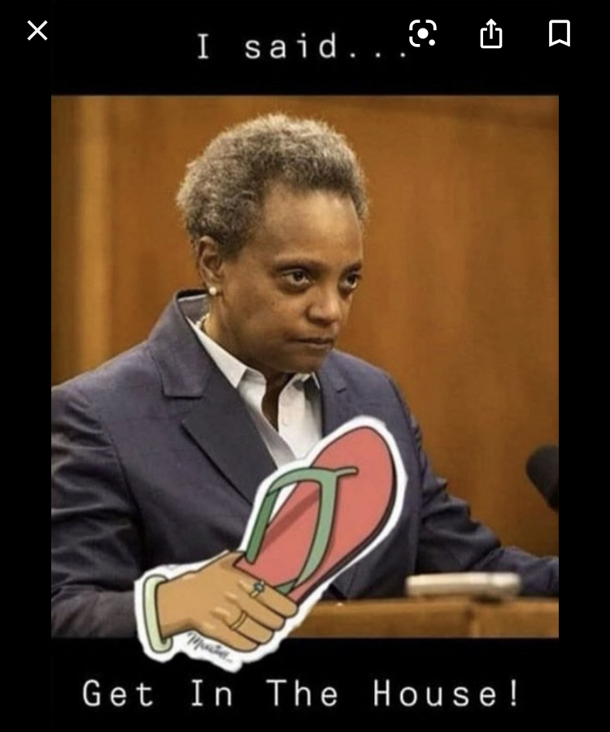

Twenty-Twenty, y'all. What a year. It was challenging for everyone in so many ways but I'm not going to rehash how insane the world got. The U.S. elections, the pandemic. The horrible, awful, 2020 world. I think we've all heard enough of that for now. This is a personal year in review. 

##The P Word

When the pandemic hit in March, I was just coming out of a slow start to the year. It was a long, cold winter going into 2020 and I was feeling the weight of [SAD](https://www.mayoclinic.org/diseases-conditions/seasonal-affective-disorder/symptoms-causes/syc-20364651). But the weather was starting to show signs of life in Chicago and I was looking forward to getting out of my funk, start running again, and into more sunshine.

Nothing about this year turned out like anyone expected though. March came and went and the weather got nicer, but most of us started to heed the warnings about the pandemic. We bought masks and then turned right around and went back inside:

_Chicago Mayor Lori Lightfoot, doing her thing._

And that's exactly what my partner and I did for the last 9 months (and counting). We did a few things throughout the year though which seems strange to highlight but here's the complete list of our 2020 adventures:

- We went to a restaurant 3 times (always outside and with masks).
- We went to WI for an afternoon to use my brother's boat, alone. A few hours in the sun on the water was probably the most enjoyable thing we did all year.
- We visited a (Chicago) beach on my birthday (with security guards keeping people out). 
- I ran the [Soldier Field 10 Mile](https://www.soldierfield10.com/) (which I've done for the last 5 years) virtually.

_Happy birthday to me, 2020._

So that's it. That's the entire list of adventures from the year. Thrilling.

Otherwise, we've both been working from home and simply staying in. We leave the house for groceries and to walk the dog and that's about it.

## Work, Work, Work

With not much else to do, I filled my days with work and there were a few highs and lows.

### The good

I worked hard in the spring to pass a couple of tough Salesforce certifications. The first being the [Salesforce Administrator](https://trailhead.salesforce.com/credentials/administrator) exam. Studying for this one ate up a lot of weekend hours and in hindsight, I regret a little losing those weekends before the pandemic truly hit. People were still enjoying their friends and family and having a nice time brunching carefree. I failed my first try and ended up cramming back-to-back weekends for this one. It was a relief to pass eventually but damn how I wish I had those weekends now.

The second certification I earned this year is [Javascript Developer I](https://trailhead.salesforce.com/credentials/javascriptdeveloperi). Being developer-focused, this one was a lot more fun than the previous admin exam. I nearly didn't get to take it because testing centers were starting to close from the pandemic but I managed to slip in and passed on my first try. After completing the [Lightning Web Components Specialist](https://trailhead.salesforce.com/content/learn/superbadges/superbadge_lwc_specialist) project in June, the certification became official. 

And then I got promoted! 🎉  In August, I was promoted to Senior Front End Developer which felt like a culmination of a lot of hard work. I've been in the web industry for over a decade doing various roles but for the last few years I've invested a lot of time to becoming a better software developer. Getting this promotion validated all of that hard work and I couldn't have been happier to get the nod.

### The bad

Working all the time is a great distraction but this year I experienced some challenges from overwork and high stress. Working for a consulting agency isn't for everyone but one advantage is that, from one project to the next, you have variation. There are peaks and valleys and I've generally found myself in a manageable level of stress doing this type of work. I've enjoyed working on challenging projects and then moving on to something that was maybe less demanding (or the other way around). It has been an interesting and oftentimes fun journey so far.

But I hit a breaking point late in the year. It could have been the cumulative stress from it being 2020 in general in combination with a challenging project but I hit a very scary breaking point this year.

After working on this challenging project into the fall, I started to feel chest pains. I'm not a great sleeper under normal circumstances but now this chest pain was keeping me from falling asleep too. The chest pain turned into left shoulder pain which then turned into shooting pain down my arms. Then one day I was sitting at my computer about to start coding and I could not move my hands. It was one of the strangest and scariest feelings. I was trying to move my fingers on the keyboard but they would not listen to my commands. "Is this what a heart attack feels like!?", I thought to myself. I made a doctor's appointment immediately.

Although I can't go into details about the specific project, I will say that I was working directly with a FAANG and to say that the pressure was high would be an understatement. There were weeks that I was working 60-70 hrs/week sometimes with multiple weeks in a row without days off. My partner was having to shoulder everything in the household and I felt horrible about that too. It was always in the back of my head that maybe this was all stress-related but I couldn't be sure without a trip to the doctor.

The doctor did an EKG, a blood test, and checked my blood pressure. The good news was that I was most certainly **not** having a heart attack. The EKG and blood test were fine. I did have high blood pressure but she couldn't find anything else physically wrong with me.

Stress and anxiety were manifesting in all of these physical symptoms. I was getting burnt out (if I wasn't already) and the level of stress I was poorly managing was finally catching up to me.

Just knowing the results of those tests helped bring my anxiety down a little which made the physical symptoms lessen enough to be able to carry myself to the end of the year without any more spontaneous numbness. But I have some more work to do if I'm going to get myself in a healthier state.

## Looking ahead to 2021

All things considered, there were still a lot of accomplishments from 2020. The big lesson this year taught me though is that I need to **commit myself to a better work/life balance** in 2021. I'm not good at managing high levels of stress and honestly, I don't want to be "good" at it. I just don't want to find myself in that position.

I'm dedicating 2021 to fiercely protecting balance in my life both mentally and physically. Like a true data nerd, I'm going to start tracking my sleep, my blood pressure, my heart rate, and I'm going to commit to removing myself from or limiting my exposure to situations that are detrimental to my health (I'll have the data to back me up this time 🤓). Are you using any biometric tracking apps/devices? I would love to hear what's working for you!

With that I wish everyone happiness and health in the new year! Be good to yourself and others! Thanks for reading! 👋