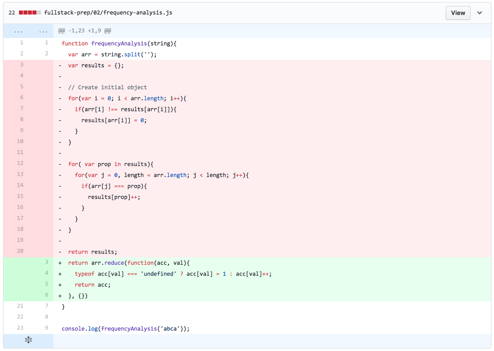

When I decided that I wanted to take a shot at the [Fullstack Academy](https://www.fullstackacademy.com/) software development program, I had already done a lot of research. I read every Google search result I could find (I probably got 10 pages deep one day!). I looked at the Linkedin profiles of graduates to creep on their experience and employment after graduation (I reached out to a few of them too and everyone was incredibly friendly and helpful!).

I even setup a Google alert to email me when something new came online with the FA keyword and trawled through all of the Course Report reviews, Medium articles, blog posts, Quora responses, and everything in between.

In retrospect, besides the [admissions material](https://www.fullstackacademy.com/admissions) on the Fullstack website itself, the most useful thing for me was reading the personal experiences of people who had gone through the process (both successful and unsuccessful candidates). Now that my application process has completed, I thought it would be a good opportunity to pay it forward to you, ambitious future Fullstack Academy applicant!

## Some Background

It’s fair to say that I have some experience with coding already. I’ve worked in the web development field in some capacity for nearly 10 years. I’ve done WordPress development, website design, freelancing, and consulting. That translates to a lot of HTML/CSS, some server side stuff (PHP, SQL), some Javascript stuff, but no computer science. And I’m almost entirely self taught.

To gauge where I was technically at the time of my application, I would say that I could probably get through most of the [CodeWars](https://www.codewars.com/) level 8 kata, some level 7 but starting to struggle, and probably not a single level 6 without Stackoverflowing the heck out of it. I had very specialized knowledge in WordPress dev, HTML templating, and graphic design which are great skills to have but there was some catching up to do if I wanted to transition into fullstack software development.

## The Why

My decision to go back to school was the result of having a hard look at my career trajectory and realizing that it was taking me further away from my interests (coding!) rather than closer.

I first started researching Computer Science degrees a few months ago but ultimately decided it wasn’t a realistic option for my situation because it would have taken many years to finish and I wasn’t confident that I would be able to market my skills afterwards.

I was making a big decision and leap of faith to make this change so, if I was going to go to an immersive school, I had to 100% trust their program. It had to be focused on my long term success and I had to feel confident that it would give me the skills (and confidence) I needed to apply for the jobs that I wanted. The bottom line was that I had no time to waste.

The more I learned about FA, the more I felt like it was going to be my best chance at taking that leap from a website template creator that’s dabbled in JavaScript to a software engineer. The fact that they’re selective about who they accept into the program (some sources say the acceptance rate is ~8%) only made me more confident in the program. I knew that getting accepted was far from guaranteed but I wanted to give it a shot.

## The Application

I had some vacation time during Christmas so I spent a week of that going through all of their [prep exercises](http://prep.fullstackacademy.com/) and reading through Javascript resources. I was feeling pretty good about being able to solve most of the exercises so on New Years Eve, I sent in my written application.

The application itself wasn’t particularly long but I put in a good bit of time preparing my answers. I’m not sure how much weight it’s given in the overall evaluation process but they do measure candidates on a variety of criteria like educational/professional background and culture fit so I wanted to make sure those areas came through.

Something I’m also really glad that I did during this week was create a Github repo for my solutions to the exercise problems. I though it would be nice to reference my solutions later but I discovered that the real value was when I re-wrote all of those solutions during my 2nd prep stage. I could clearly see how I had improved on them looking at the diffs (example screenshot a bit further down). I was also able to use those diffs to highlight how I had improved throughout the application process and what my thought process was between the two solutions during the interview phase.

## Coding Assessment Exam

The application process has three major phases:

1. Written Application
2. Online coding assessment exam
3. Technical Interview(s)

I sent the application on December 31st and I received an email on January 2nd inviting me to take the online assessment which was a much quicker response than I expected!

The exam was on the HackerRank platform with 6 problems of increasing difficulty (going from easiest to hardest). You’re given 75 minutes to complete them and once you begin, your browser goes fullscreen to deter Google-foo.

I won’t give details of those questions but I will give some tips:

1. If you’ve never used HackerRank before, get familiar with it first before taking the assessment. This means doing actual problems on the platform to get a feel for how it works. This was something I wish I had done. You want to spend all your time focusing on the problems, not the platform.
2. I promise you’ll panic at some point but just breathe. If you don’t know the complete solution, start writing out your thought process into the editor. Let them see the steps you think might work even if you’re not sure how to code it. You can submit answers without the tests passing.
3. You’ll be able to go between questions without having a solution for the previous one so if you want to work on them out of order, go for it.
4. As part of your prep, practice timing yourself solving CodeWar problems (or similar) before the exam. This was my first experience being timed like that and it was terrifying. Practicing that format before probably would have helped me a lot.

In the end, I think I was only able to complete three of the questions. For the other three, I wrote out possible solutions and ideas on how I might approach them but ultimately I simply ran out of time. Those 75 minutes go quicker than you think!

Not to be deterred, I still really wanted to know how to solve all of them so I spent a little more time after the exam working them out. I quickly found solutions to questions 4 and 5 (amazing how your brain starts working again when it’s not being timed) and sent them to admissions right away. I’m not sure if that really mattered in the end and I still wasn’t certain about the final question but I had a pretty good idea of what I needed to study up on. Surprisingly they wrote back that same day letting me know they were forwarding those final solutions to the assessment team so I was hopeful that I didn’t completely bomb it.

On Friday, January 5th, I completed the online assessment and on Monday, January 8th I received an invitation to an interview. 🎉

## Technical Interview Part 1

Everything was moving a lot faster than I expected. I scheduled my interview for the following Friday which left me about a week to prepare.

Even though I was invited to an interview, I was feeling a little less confident after the online exam so I studied more over that weekend reading about methods on arrays, recursion and working through more Codewars problems. In retrospect, I probably should have given myself more time to prepare especially since I was working full time on top of it all.

For the interview itself, we talked a little about my background and about the program itself. I had gone to one of their information sessions the week before where I was able to ask questions so I already had a chance to ask questions about the program.

Most of the interview time was spent working through two problems both I would rate as very fair assessments and relatively challenging. It took the entire hour for us to work through them both. The interviewer was really skilled at offering small guidance without giving the entire thing away but even with their excellent direction, it took some effort for me to work through them

In the end, I was able to find solutions to both but I had a nagging feeling that I wasn’t communicating my thought process well enough and my solutions weren’t exactly elegant or efficient (see O(n²) ). On top of that, it was my first live-coding / pair-programming experience so lots of nervousness and brain locks.

Honestly, I left feeling like I took a pretty good swing at it and thought that I demonstrated my potential although there were clear gaps in my knowledge and I was pretty lost when refactoring them to be more efficient.

## Technical Interview Part 2

The same day, I got an email letting me know they’d like me to schedule a final round interview. They saw my potential but wanted to give me more time to study and prepare which, at the time, I didn’t quite understand so I asked for more feedback on my performance (and what I should be focusing on).

The feedback they gave was helpful but ultimately it was more about preparing myself more for the program itself from the [material they recommend on their site](https://www.fullstackacademy.com/admissions-preparation). They have a lot of experience with candidates and what it takes to be successful and, while initially disappointed that I didn’t get a green light straight away, I entirely trusted their judgement.

So for the next 4 weeks, I set myself to focusing on solving every problem I could get my hands on using only recursion or methods on arrays. I spent more time in Codewars land, going over the prep exercises again, and dug into the algorithms section of Free Code Camp.

It became clear to me how important this extra preparation time was when I pushed new solutions to the same [prep exercises](http://prep.fullstackacademy.com/) I had done earlier. My improvements were clear:

When it came time to do the final technical interview, I was still super nervous (live coding is going to take some getting used to!) but I could communicate, debug, and work my way through the problem set a little easier than the first time around. I also felt like I had a bigger toolbox in general.

Two days after the final interview, I officially received my acceptance into the program. 🎉

## My Resources and Other Advice

Stay positive. For some, this process might be easy and for others, it could take more preparation and patience. Just make sure that you’re hungry to learn and that you love what you’re learning before you dive in.

For someone coming from no background in code, they recommend studying 3–5 months before applying which is probably accurate. I have some experience already so I needed ~6 weeks to prepare. This preparation time will be different for everyone depending on experience and available time but it can be crucial. Don’t short yourself.

Some content specific advice would be to focus on algorithm exercises, array methods (reduce, map, etc) and simple recursion. Standard for loops are ok but you might want to have an idea on how to improve your solutions. Having a basic understanding of complexity (Big-O Notation) won’t hurt either.

My Tools and Resources:

- [Flashcard Hero](http://flashcardhero.com/) — Every time I came across a method on a function, array, string, number, or anything else I thought important to memorize, I made a flashcard for it. You don’t have to have everything memorized but you won’t be able to or have time to look things up while you’re going through the assessment test or interviews.
- [Eloquent Javascript](http://eloquentjavascript.net/3rd_edition/) , 3rd Edition — I would recommend going through chapters 1 to 5 at a minimum but more wouldn’t hurt including the exercises at the end of each chapter..
- [Bootcamp Prep Exercises](http://prep.fullstackacademy.com/) — Especially the Medium level set and try to do as many of them as you can without using for loops. Again, there’s not necessarily anything wrong with writing out your solutions this way but being able to talk about other approaches will be an advantage.
- [CodeWars ](https://www.codewars.com/)— Lots of level 8, 7, and 6 but go for higher if you can.
- [Free Code Camp](https://www.freecodecamp.org/map) — The algorithms section was the most useful area for me.
- [MDN docs ](https://developer.mozilla.org/en-US/)— This is the only source I used when hunting down methods and examples.

## What's Next

In the coming weeks, I’ll be working with their admissions team and will start preparing for the program (more studying!) as well as get financials and other things in order.

The entire process so far has been incredibly humbling and it’s made me realize how much more I need to learn. I fully expect every phase of the program to be challenging especially if the application process is any sort of measure for what’s to come.

Good luck if you’re reading this and have decided to apply too! Hopefully reading about my experience has helped!