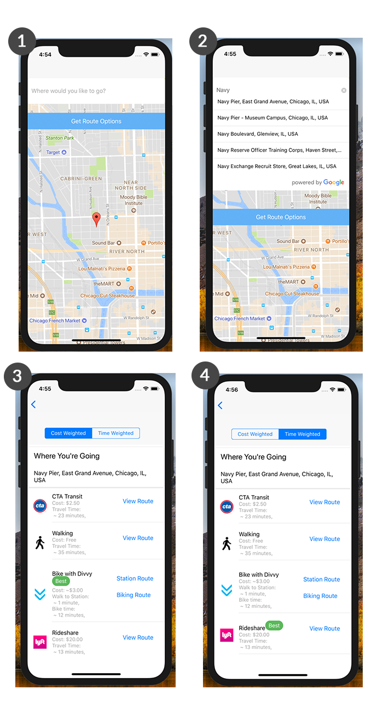

Over the weekend I [built a mobile app](https://github.com/jamigibbs/get-me-there-better) to explore React Native and the mobile development process. While thinking about what I should build, I considered my own commutes and how I wish they could be better (I was likely commuting when I was thinking about it!). I take the train to and from Chicago’s northside to the River North neighborhood every day and I assumed city transit was the most efficient option by cost and time but I wasn’t certain.

So I set off to build an app that would provide multiple transportation options with a given location and destination and determine which of those options were better optimized for cost and time savings.

I assumed the user didn’t have a personal car (because I don’t) and that they could only use transportation options in Chicago. Those options are; train/bus, car ride sharing, bike sharing, and walking.

In the end, my app’s flow turned out to be as follows:

1. The app displays the user’s current location and asks them to input a destination address.
2. With Google Location services, it autocompletes the destination address as the user is typing.
3. The app returns each transportation options including cost, travel time, and links to routes.
4. When the user toggles between “Cost Weighted” and “Time Weighted”, it marks the transportation option that’s optimized for that weight type.

But in the process of building the app, I came across an interesting problem: how to find the nearest location from an array of locations? Specifically, I needed to find the nearest Divvy bike station from the user’s current location and provide them with a link to view the route to that station.

## Starting With Current Location

At this point in my development, I already had available the user’s current location. This was accomplished by storing the geolocation provided by the user’s device (after the user granted permission, of course). The following snippet demonstrates how I accomplished this using [Expo’s Location module](https://docs.expo.io/versions/latest/sdk/location):

`gist:jamigibbs/548fec05761724b674722db60b39bcfb`

I’m passing a boolean value into my `getCurrentLocation` thunk creator that allowed me to filter against the app being run in a simulator (which did not provide me accurate geolocation data). Then the `Location.getCurrentPositionAsyc` promise returns the user’s location and dispatches it into to my Redux store.

If you’re not using Expo, you could also accomplish this with the [React Native Geolocation service](https://facebook.github.io/react-native/docs/geolocation.html). Using either method, the end result would be the same; access to the latitude and longitude values of your user’s current location.

## Dealing With Divvy Sations

In Chicago, the bike sharing service [Divvy](https://www.divvybikes.com/) has many hundreds of bike stations across the city. If I used the [Divvy station public API endpoint](https://feeds.divvybikes.com/stations/stations.json), I would need to search through over 500 city locations before I could find the nearest station. That seemed woefully inefficient.

Instead of searching through every existing Divvy bike station individually, I could narrow it down to a search radius based on the user’s current location. After some research, I discovered that the Google Places API allows for just that using the `nearbysearch` endpoint and `radius` flag.

So now my request looked like this:

> https://maps.googleapis.com/maps/api/place/nearbysearch/json?location=${lat},${lng}&radius=1000&type=point_of_interest&keyword=divvy&key=${API_KEY}

The user’s current location was passed as `lat` and `lng`, with a search `radius` of 1000 meters, and all `point_of_interest` types for `divvy` returned. For any given location in Chicago, this query returns between 5–20 stations within a location radius. Not exactly what I was after but I was getting closer.

Of those stations within a 1000 meter radius, we could then check for a distance value from our current location against each station. To do this, I employed the help of the [Geolib](https://github.com/manuelbieh/Geolib) library for distance calculations along with a couple of familiar Javascript array methods; map and sort.

I started with a thunk creator that received the user’s latitude and longitude for our Google places query:

`gist:jamigibbs/3fe01d559a6e6e1059cf33a431f55efa`

The data returned from the GET request (using [Axios](https://github.com/axios/axios) in this case) included an array of individual station locations. This gave me access to the latitude and longitude of each surrounding station but it came with a great deal of other information I didn’t really need in my Redux store. I only need the station’s latitude and longitude at `geometry.location` and eventually the distance from our starting point.

`gist:jamigibbs/b59a3cf4ae7eec03601de85f71e4a7b2`

I then mapped through each station and found just the latitude and longitude coordinates that I needed for each:

`gist:jamigibbs/a991893d5e2e58eab6f13425953da67a`

So now the station data looks like this:

`gist:jamigibbs/2a81e507520818108532d9fdc2a0c94d`

With each station coordinates, I could now calculate a distance value for each in the map and add that to my new array. By leveraging the Geolib library, I mapped over the location coordinates, calculated the distance value, and added that it to a new array of data:

`gist:jamigibbs/44e1c74789efdba01334a80499f20e1c`

The resulting array after adding the distance value to each station location now looked like this:

`gist:jamigibbs/f3efbdb42f51bc74d365694c0e43adf1`

With our distances calculated, it was then just a matter of sorting for the closest station using the `sort` method and taking the first (closest) location:

`gist:jamigibbs/1b69fabfe07ed7ce18adc1675faeea64`

Our Redux thunk that dispatches the closest Divvy bike station is now complete:

`gist:jamigibbs/f091b1043f5551c6e5c6b8f8d71910fd`

## Conclusion

Working with API data can be challenging when you’re not getting exactly what you need to accomplish your task. But often you can solve the issue by working through the given data incrementally to transform it into the desired output. In this situation, the Google Places API allowed me to search within a specific radius area relatively easily but it took some creative data manipulation to be able to add a distance value as well.