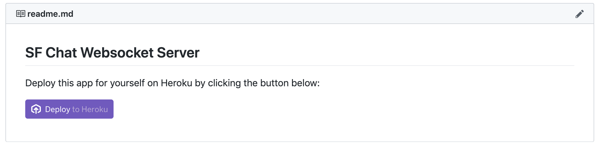
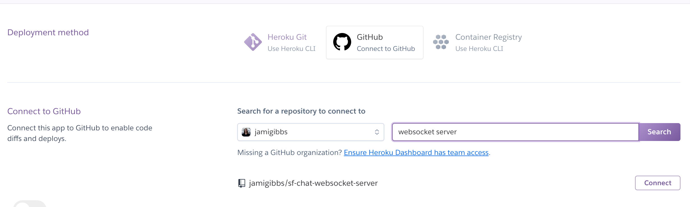
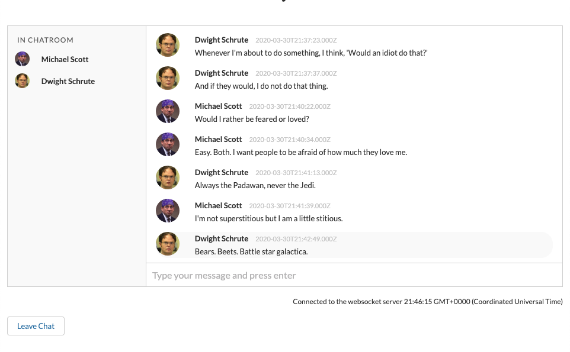
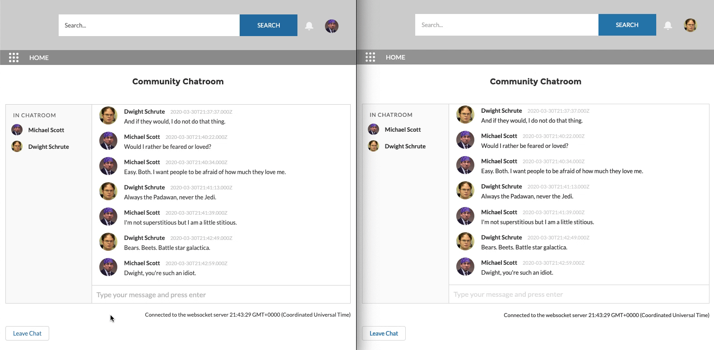

A websocket connection is a way to exchange data between browser and server with a persistent connection. This type of connection is perfect for applications that require continous data exchange like multiplayer games, collaborative white boards, sports tickers, and chats.

I started to consider websockets in Salesforce when I noticed that their native [Chatter](https://www.salesforce.com/products/chatter/features/) component required a manual refresh before the latest chat messages would display. Why couldn't it automatically display the incoming chat messages with websockets?

I discovered that Salesorce databases and their backend language Apex, only supports HTTP/1. Websockets or GRPC(HTTP/2) are bi-directional and not supported by Salesforce natively so you can't achieve that magical refresh with Chatter using websockets. Bummer, right? (Well, they probably could use [http polling](https://realtimeapi.io/hub/moving-polling-long-polling/) but it's potentially resource intensive and maybe there are other server limitations that I'm not aware of too.)

But there is a way to use Websockets with Salesforce and that's what I set out to experiment with here.

## The Websocket Server

Knowing that I couldn't host a Websocket server in Salesforce, I turned to Heroku (although any other type of server that supports this protocol will work). With Heroku, you can create a simple Node server in seconds and integrate websockets with it for communicating with your Salesforce org.

While you could certainly use the native [Websocket API](https://developer.mozilla.org/en-US/docs/Web/API/WebSockets_API), I've used [socket.io](https://socket.io/) in the past and liked some of the fallback features it provides (like long polling) so I decided to integrate that.

The start of our basic Node server with Websockets looks like this:

`gist:jamigibbs/a0a5a8488ac7e07f203e6870014a7ab0`

As I continue to build out my chat component, I'll make several additions to this initial server file to accomodate the different websocket events I'm passing to it. You can see the complete `server.js` file on my [SF Chat Websocket Server](https://github.com/jamigibbs/sf-chat-websocket-server/blob/master/server.js) repo.

## Deploying the Server to Heroku

While there are several different ways to deploy your server to Heroku, probably the simplest is to deploy from a Github repo. 

For this project, I created a repo that you can also use to deploy to Heroku directly just by clicking the "Deploy to Heroku" button:

https://github.com/jamigibbs/sf-chat-websocket-server

Or you could simply create a new app in Heroku, connect it to your Github repo, and make deployments there:

## Chat Component Overview

For my chat component, I wanted to implement three basic features:

1. Display a single chat room with active chat users listed in a sidebar.
2. Allow chat users to enter and leave the chatroom.
3. Display a visual indicator when someone is typing.

So our chat room will look something like this with active users on the left side, chatroom messages displayed in the center, and an input field below for the current user to add messages to the chatroom:

## Custom Object and Fields

To keep track of the chat room messages, we'll need to create a single custom object called **Chat Message** (`Chat_Message_c`). On that object, there are two custom fields:

- Content__c (Textarea)
- User__c (a lookup to the User object)

Additionally, we'll need to add a custom field to the **User** object called `Chat_Active__c` (Checkbox). We're adding this field to keep track of when a user has entered or left the chatroom.

## Apex Queries

Now that we have our object and fields setup, there are some Apex queries we'll have to create for the frontend:

1. Get chat messages
2. Get active chat users
3. Set chat user active
4. Set chat user inactive

These are all pretty straight forward SOQL queries especially when we're only dealing with a single chat room. But you'll notice that I'm limiting our messages to only those created `today` which isn't a particuarly realistic chat scenario. Ideally we would be able to handle multiple chat rooms and limit our query to that specific room. Multiple chat rooms were out of scope for this particular exercise so we're just displaying messages for the current day.

`gist:jamigibbs/af0f89f3190848a346d35c0b072ee680`

You can see the complete `ChatController` class on my [LWC Websocket Chat repo](https://github.com/jamigibbs/lwc-websocket-chat/blob/master/force-app/main/default/classes/ChatController.cls).

## Socket events

Now we can finally connect our component with the Node websocket server we setup earlier. I mentioned before that I'm using [socket.io](https://socket.io/) so the first step is to import the 3rd party script into the component.

The socket.io script will need to be added as a static resource and loaded from the `resourceUrl` module.

You'll also need to pass the websocket server url (in our case, it's the Heroku link) from a custom label. The websocket server url will be the Heroku app link but with `wss` protocol instead of `http`. 

For example: `wss://my-heroku-app.herokuapp.com/`:

`gist:jamigibbs/d99d1dbb57508b446d3fd232cb549cee`

When communicating between the client and the server (and vice versa), there will be an event that's emitted (`emit`) and an event that's received (`on`);

To build out our chat app, we're going to use a series of emitted and received events for communicating chat actions like when a message is added to the chat, when a user leaves, and when a user enters.

### Chat Message Added

A good example of how our socket events will flow can be demonstrated when a user adds a chat message.

When a message is submitted (in this case, the enter key is pressed on the input field), we'll first add a new `Chat_Message_c` record. After that's successful, we'll `emit` a socket message called "transmit" which will let our other users know to refresh their data for a new message:

**websocketChat.html** - The user has entered a message into an input field:
`gist:jamigibbs/6237b56dc7a832139a19e9dee11644c9`

**websocketChat.js** - When they submit/press enter, a chat message record is created using the [createRecord](https://developer.salesforce.com/docs/component-library/documentation/en/lwc/lwc.data_salesforce_write) module and on success, we emit the "transmit" socket event:
`gist:jamigibbs/559e3d39a185e1d1abc797e40d4c89cf`

**server.js** - The server, listening for the "transmit" event, emits another event back to the web component called "chatupdated":
`gist:jamigibbs/c9a42ccdf13eb9ca215b1d7f9b4e0bd8`

**websocketChat.js (again)** - Now _all_ active components receive this "chatupdated" event which refreshes the messages list to display (nearly) instantaneously the latest message (or however long it takes Salesforce to refresh its cache via [refreshApex](https://developer.salesforce.com/docs/component-library/documentation/en/lwc/apex#data_apex__refresh_cache)):
`gist:jamigibbs/a98cd7620ffa454316f14b4d2f1798a1`

### Entering and Leaving Chat

Similar to how the chat messages work, we can display when a user enters or leaves the chat room by toggling a `Chat_Active__c` checkbox on their user record and update the sidebar active user list accordingly.

When the user clicks enter or leave the chat, this triggers a socket event chain similar to when we added a new message:

**websocketChat.js** -- When the user clicks the enter or leave chat button, the user record is updated and we emit the event `userEnteredChat` or `userLeftChat` to our socket server:
`gist:jamigibbs/eaf0ca6e0b6c9f318ee44acd2a72e9b5`

**server.js** -- On the websocket server, those events are captured and it sends back to Salesforce a `refreshChatUsers` event:
`gist:jamigibbs/f1892d5b6f25705839d2a491ec0d89e0`

**websocketChat.js (again)** - Finally, our component will refresh the active user list for _all_ users connected to the chat in the same way that we refreshed the chat messages using [refreshApex](https://developer.salesforce.com/docs/component-library/documentation/en/lwc/apex#data_apex__refresh_cache):
`gist:jamigibbs/44b60652c6c87ee12a3af0cd1986c139`

### Completed Project

To view the completed chat component that includes all of the features previously mentioned, the project is available for you to install on your own scratch org from the following repo:

[https://github.com/jamigibbs/lwc-websocket-chat](https://github.com/jamigibbs/lwc-websocket-chat)

The correspoding node websocket server is also available here:

[https://github.com/jamigibbs/sf-chat-websocket-server](https://github.com/jamigibbs/sf-chat-websocket-server)

## Final Thoughts

Because we still have to make HTTP requests through the Salesforce server in order to add and fetch records, this isn't truely seemless like it would be if we were also storing data on the websocket server itself. There isn't a continous data exchange. Ideally, we could use websockets for more than just a pubsub type service where we're just bouncing events back and forth.

But it has value in creating a persistent connection and "magically" refreshing data for all connected users without resorting to polling the Salesforce server. This in itself is a pretty cool feature. I think the value that brings might need to be weighed against the effort it would take to maintain a separate external server whose only purpose is to trigger a data refresh though. I could also see some issues with security and the need to implement authentication on the external server to safeguard against rogue connections.

There are a lot of interesting nuances here though and it was fun to experiment with the technology within Salesforce. Thanks for reading!